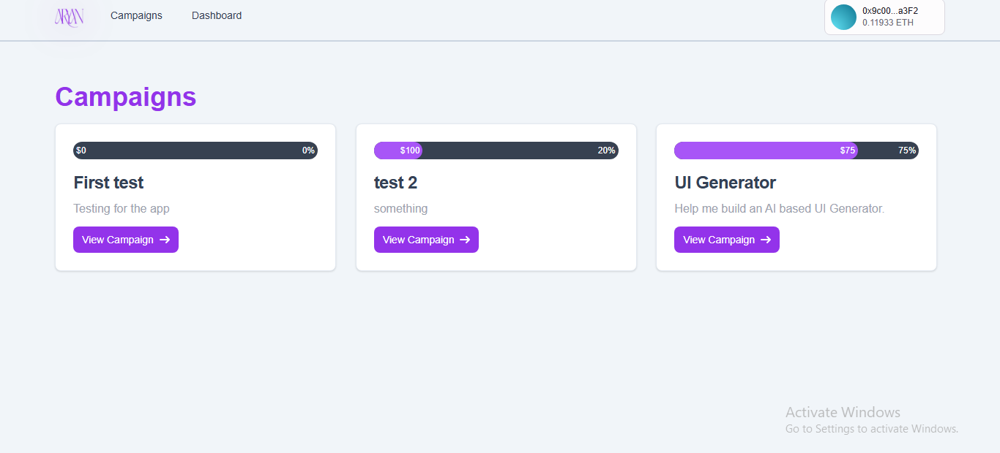
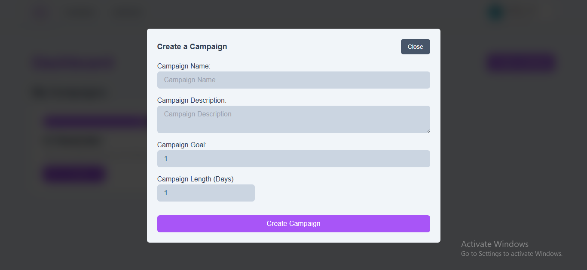
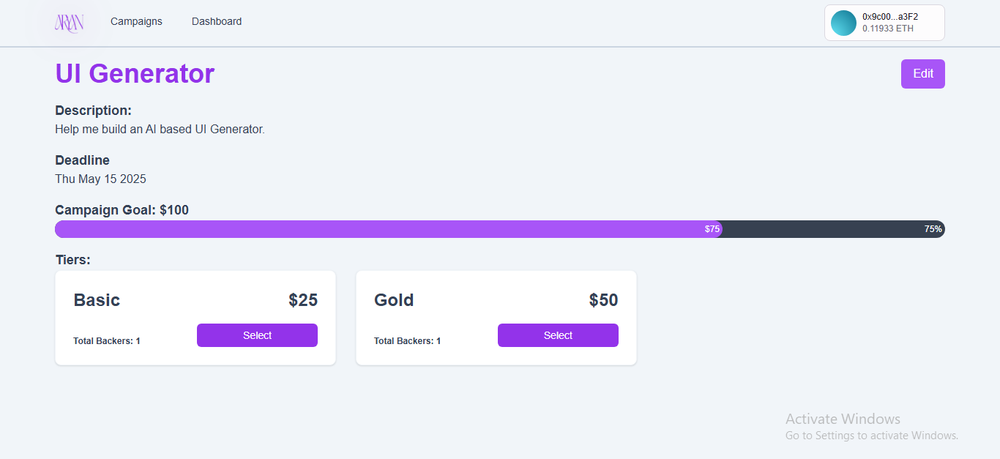
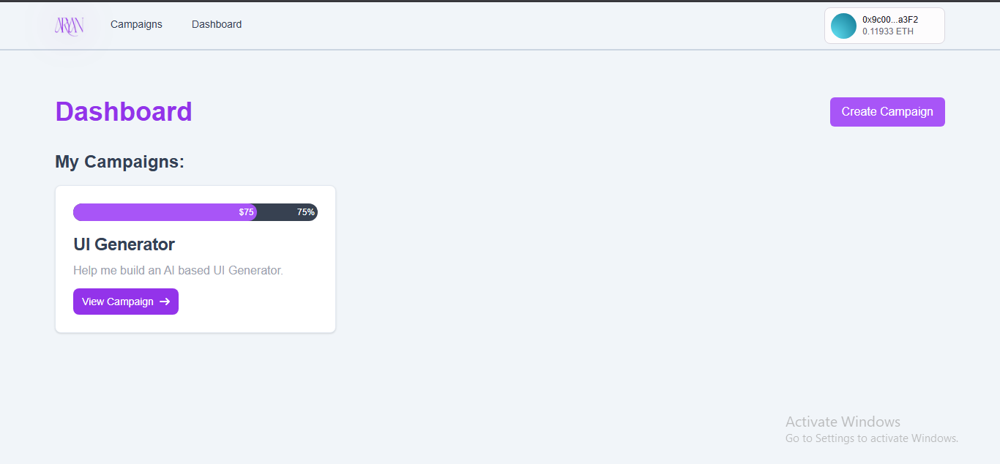

# 💸 Crowdfunding Web3

A fully decentralized crowdfunding platform built using **Next.js**, **Solidity**, and **Thirdweb**. Users can launch fundraising campaigns or fund existing ones — all transparently powered by smart contracts on the blockchain.

🔗 **Live App**: [crowdfunding-web-3.vercel.app](https://crowdfunding-web-3.vercel.app)  
📦 **Frontend GitHub**: [Aryann001/crowdfunding-WEB3](https://github.com/Aryann001/crowdfunding-WEB3)  
🛠 **Smart Contracts Repo**: [Aryann001/crowdfunding-contracts](https://github.com/Aryann001/crowdfunding-contracts)

---

## 📌 Smart Contracts

- **Crowdfunding Factory Contract (Deployed on Sepolia)**  
  [thirdweb.com/sepolia/0xe527cb1fcebe9458c98f86e16a1327b2f4b5ccd5](https://thirdweb.com/sepolia/0xe527cb1fcebe9458c98f86e16a1327b2f4b5ccd5)

- **Crowdfunding Contract (Published Template)**  
  [thirdweb.com/0x1BF8388dF69157F12d1e35A730379d4A46b3C126/Crowdfunding](https://thirdweb.com/0x1BF8388dF69157F12d1e35A730379d4A46b3C126/Crowdfunding)

---

## 🚀 Features

- 🧾 **Start Campaigns**: Launch fundraising campaigns with a goal, deadline, and description.
- 🤝 **Back Campaigns**: Fund projects directly from your wallet.
- 🔍 **Track Progress**: View contribution stats and funding progress in real time.
- ⛓️ **Blockchain-Powered**: Every transaction is secure, transparent, and trustless.
- 🪄 **Dynamic Contract Deployment**: Campaign contracts are deployed via a factory contract.

---

## 🛠 Tech Stack

### Frontend
- [Next.js](https://nextjs.org/)
- [Tailwind CSS](https://tailwindcss.com/)
- [Thirdweb SDK](https://thirdweb.com/)
- [Ethers.js](https://docs.ethers.org/)

### Smart Contracts
- [Solidity](https://soliditylang.org/)
- [Hardhat](https://hardhat.org/)
- [Thirdweb ContractKit](https://thirdweb.com/contractkit)

### Deployment & Infra
- [Vercel](https://vercel.com/)
- [Sepolia Testnet](https://sepolia.etherscan.io/)
- [Thirdweb Dashboard](https://thirdweb.com/)

---

## 🖼️ Screenshots

### 🏠 Home Page


### ✍️ Create Campaign


### 📊 Campaign Details


### 👌 Dashboard


---

## 🧾 Getting Started

### 1. Clone the Frontend Repository

```bash
git clone https://github.com/Aryann001/crowdfunding-WEB3
cd crowdfunding-WEB3
```

### 2. Install Dependencies

```bash
npm install
# or
yarn install
```

### 3. Set Environment Variables

Create a `.env.local` file with:

```env
NEXT_PUBLIC_THIRDWEB_CLIENT_ID=your_thirdweb_client_id
```

You can generate this from the [Thirdweb Dashboard](https://thirdweb.com/dashboard).

---

## ▶️ Running Locally

```bash
npm run dev
# or
yarn dev
```

Open [http://localhost:3000](http://localhost:3000) to view it in your browser.

---

## 🔐 Smart Contract Overview

### 🏗️ Factory Contract
Deploys new crowdfunding campaigns dynamically on Sepolia using Thirdweb's factory pattern.

- Contract Address: `0xe527cb1fcebe9458c98f86e16a1327b2f4b5ccd5`  
- View on Thirdweb: [View Factory Contract](https://thirdweb.com/sepolia/0xe527cb1fcebe9458c98f86e16a1327b2f4b5ccd5)

### 📄 Crowdfunding Campaign Template
Each deployed campaign contract supports:
- Receiving funds from contributors
- Tracking contributors and total funds
- Owner-controlled withdrawals once the goal is met

- Published Version: [Crowdfunding Template](https://thirdweb.com/0x1BF8388dF69157F12d1e35A730379d4A46b3C126/Crowdfunding)

---

## 📤 Deployment

This project is deployed using **Vercel**. To deploy your own:

1. Fork the repo.
2. Connect to Vercel.
3. Add environment variables in the Vercel dashboard.
4. Deploy!

---

## 🤝 Contributing

Contributions, issues and feature requests are welcome!  
Please feel free to fork the repo and submit a pull request.

---

## 📜 License

This project is licensed under the [MIT License](LICENSE).

---

## 🙌 Acknowledgements

- [Thirdweb](https://thirdweb.com/)
- [Ethereum](https://ethereum.org/)
- [Hardhat](https://hardhat.org/)
- [Vercel](https://vercel.com/)
- [Solidity](https://soliditylang.org/)
- [Tailwind CSS](https://tailwindcss.com/)

---

## 👨‍💻 Author

**Aryan Baghel**  
[GitHub](https://github.com/Aryann001) • [LinkedIn](https://www.linkedin.com/in/aryanbaghel)
